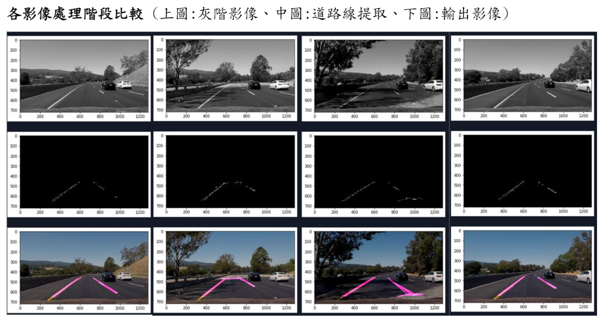
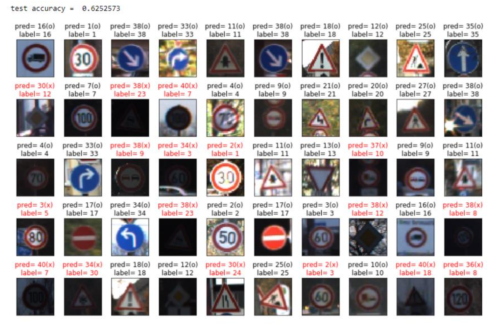

# 作業說明
### HW1: 提取道路線
流程:
1. 灰階處理
2. 高斯平滑
3. Canny Edge檢測
4. 選取感興趣的區域(即含有道路線的區域)
5. 對感興趣的區域進行 Hough Transform
6. 將繪有道路線的影像和原始影像進行疊加

### HW2: 交通號誌辨識
透過交通號誌的影像資料集
來訓練CNN網路架構**LeNet5**使其能對影像中交通號誌進行分類

